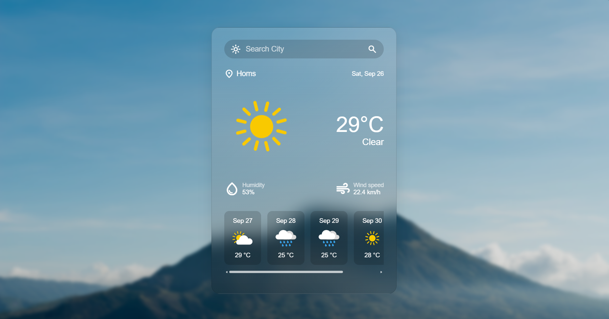
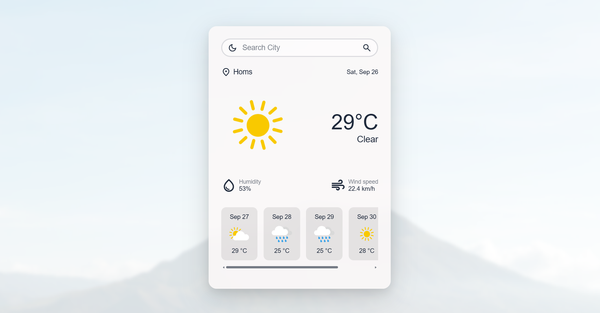

# 🌤️ Weather App


A modern, responsive weather app built entirely with **Vanilla JavaScript** — **No frameworks, no libraries!** It displays real-time weather data for any city worldwide using the OpenWeatherMap API, with a beautiful glassmorphism UI, Dark/Light mode, and 5-day forecast.

## ✨ Features

- 🔍 **Search Any City** — Type any city name
- 🌡️ **Real-time Temperature** — In Celsius
- 💧 **Humidity** — Relative humidity
- 💨 **Wind Speed** — In km/h
- 📅 **5-Day Forecast** — With weather icons
- 🌙 **Dark / Light Mode** — Saved in LocalStorage
- 🎨 **Glassmorphism UI** — Frosted-glass design
- ⏳ **Loading Spinner** — UX feedback
- ⚠️ **Error Handling** — Network & invalid cities
- 📱 **Fully Responsive**

## 🛠️ Tech Stack

| Technology | Purpose |
| :--- | :--- |
| **HTML5** | Semantic structure |
| **CSS3** | Glassmorphism, Flexbox, CSS Variables |
| **JavaScript (Vanilla)** | Logic, DOM, Async/Await |
| **OpenWeatherMap API** | Weather data |
| **LocalStorage** | Theme preference |

## 🚀 How to Run

1. Clone the repository:
   ```bash
   git clone https://github.com/ali-alfozo/weather-app.git
   ```
2. Open `index.html` in your browser.

## 🌐 Live Demo

Experience the application directly in your browser:

🔗 [https://ali-alfozo.github.io/weather-app/](https://ali-alfozo.github.io/weather-app/)

## 📚 What I Learned

- 🎨 **Glassmorphism** — Frosted-glass UIs with `backdrop-filter`
- 🌗 **Theme System** — CSS variables + LocalStorage persistence
- 📅 **Data Filtering** — Extracting daily forecasts from hourly API data
- ⏳ **Loading UX** — Spinners and state feedback during async calls
- 🛡️ **Resilient Fetching** — Handling network failures gracefully


## 📸 Screenshots

### 🌙 Dark Mode


### ☀️ Light Mode


## 👨‍💻 Author

**Ali Alfozo**
 
- GitHub: [@ali-alfozo](https://github.com/ali-alfozo)


